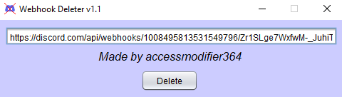
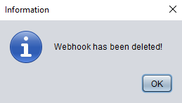
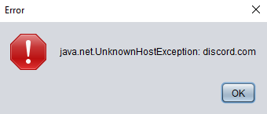

# WebhookDeleter
> An easy-to-use tool to deleting discord webhooks.

## Usage
Download the latest [release](https://github.com/accessmodifier364/WebhookDeleter/releases/).
> 1.- Put the webhook into the `TextBox` and press `Delete`. 

> 2.- You'll notice a message which show you the result or exception (if happen). 
 